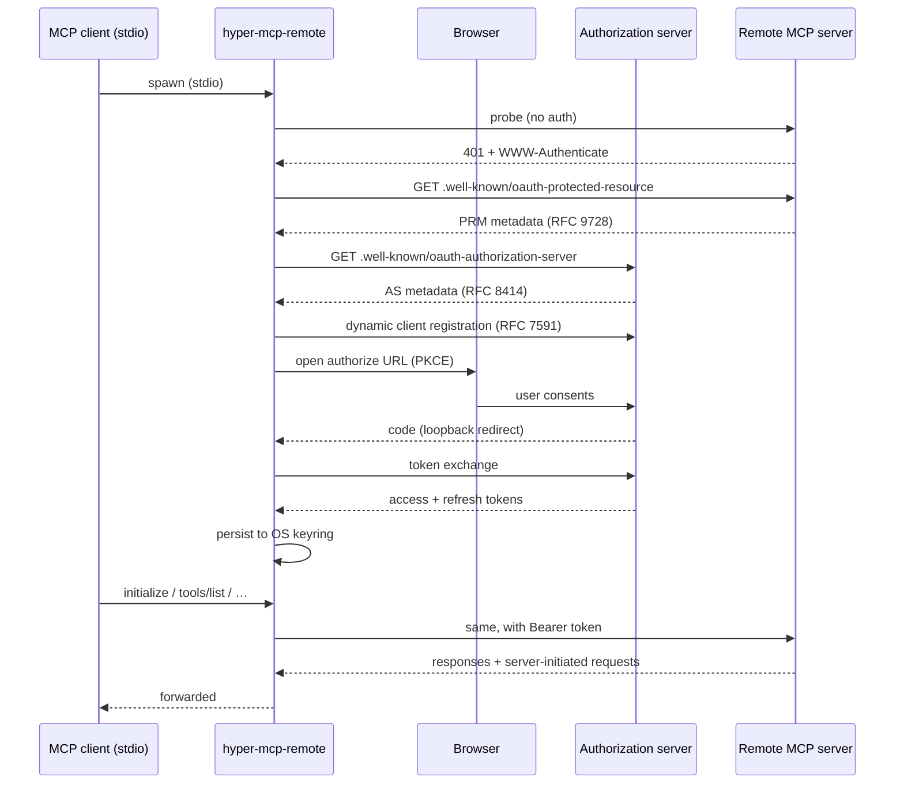

# hyper-mcp-remote

[](https://github.com/hyper-mcp-rs/hyper-mcp-remote/actions/workflows/ci.yml)
[](https://crates.io/crates/hyper-mcp-remote)
[](LICENSE)

A small, fast **stdio → Streamable-HTTP MCP proxy with OAuth 2.1**, written in
Rust.

`hyper-mcp-remote` lets any local [Model Context Protocol](https://modelcontextprotocol.io)
client that only speaks **stdio** — Claude Desktop, Cursor, Zed, Continue,
Windsurf, … — connect to a **remote** MCP server that speaks
[Streamable HTTP](https://modelcontextprotocol.io/specification/2025-03-26/basic/transports#streamable-http)
and requires OAuth.

It is a drop-in Rust alternative to the
[`mcp-remote`](https://www.npmjs.com/package/mcp-remote) npm package — no
Node.js runtime, single static binary, OS-native secret storage.

---

## Why?

The MCP specification defines two transports:

- **stdio** — what almost every desktop client implements.
- **Streamable HTTP** — what hosted/remote servers (GitLab, Linear, Atlassian,
  Cloudflare, GitHub, …) use, often gated by OAuth 2.1.

If your client only speaks stdio, you need a bridge. `hyper-mcp-remote` is
that bridge:

```text
┌────────────────┐  stdio  ┌─────────────────┐   HTTPS + OAuth  ┌────────────────┐
│  MCP client    │ ──────▶ │ hyper-mcp-remote │ ───────────────▶ │ remote MCP svr │
│ (Claude/Zed/…) │ ◀────── │   (this crate)   │ ◀─────────────── │ (GitLab/etc.)  │
└────────────────┘         └─────────────────┘                  └────────────────┘
```

On first run it performs the full MCP OAuth dance
(RFC 9728 discovery → RFC 8414 metadata → dynamic client registration →
OAuth 2.1 authorize + PKCE → token exchange), pops the user's browser open
for consent, and stores the resulting refresh token in the OS-native secret
store. Subsequent launches start with **no user interaction**.

## Features

- 🦀 **Single static binary** — no Node, no Python, no runtime to manage.
- 🔐 **Full MCP OAuth 2.1** — discovery (RFC 9728 / RFC 8414), dynamic client
  registration (RFC 7591), PKCE, refresh, RFC 8707 resource binding.
- 🗝️ **OS-native credential storage** — macOS Keychain, Windows Credential
  Manager, freedesktop Secret Service. Falls back to a `0600` JSON file when
  no keyring backend is available (headless Linux, CI).
- 🔁 **Bidirectional proxy** — forwards sampling, elicitation, `list_roots`,
  log notifications, progress, cancellation, and resource update streams in
  both directions.
- 🧩 **Custom headers with `${ENV}` interpolation** — pass API keys or extra
  tenant routing headers from your MCP client config.
- 🪵 **Safe logging** — writes to a daily-rolling file (stderr is unusable on a
  stdio transport); install location is overridable via
  `HYPER_MCP_REMOTE_LOG_PATH`.
- 🚦 **Refuses cleartext** — non-loopback `http://` URLs are rejected unless
  you explicitly pass `--allow-http`.
- 💓 **Keepalive pings** — periodic MCP `ping` requests keep the remote
  session warm across idle load-balancers, NATs, and server-side timeouts,
  with an early log-visible signal when the upstream becomes unreachable.
- 🧹 **Tool filtering** — allow/deny tool names with glob patterns when an
  upstream publishes more tools than your client actually needs.

## Installation

### From Homebrew

```sh
brew tap hyper-mcp-rs/tap
brew install hyper-mcp-remote
```

The tap ships prebuilt binaries for macOS (Apple Silicon) and Linux
(`aarch64` and `x86_64`).

### From GitHub Releases

Every tagged release publishes prebuilt, checksummed binaries on the
[releases page](https://github.com/hyper-mcp-rs/hyper-mcp-remote/releases).
The following targets are available:

| Platform                | Asset                                                |
| ----------------------- | ---------------------------------------------------- |
| macOS (Apple Silicon)   | `hyper-mcp-remote-aarch64-apple-darwin.tar.gz`       |
| Linux (`aarch64`)       | `hyper-mcp-remote-aarch64-unknown-linux-gnu.tar.gz`  |
| Linux (`x86_64`)        | `hyper-mcp-remote-x86_64-unknown-linux-gnu.tar.gz`   |
| Windows (`x86_64`)      | `hyper-mcp-remote-x86_64-pc-windows-msvc.zip`        |

Each tarball/zip contains a single static `hyper-mcp-remote` binary; drop it
anywhere on your `PATH`. A matching `checksums-<target>.txt` (SHA-256) and a
CycloneDX `sbom.cdx.json` are uploaded alongside each release.

Every `.tar.gz` and `.zip` release asset is signed with
[`zipsign`](https://github.com/Kijewski/zipsign) using an ed25519 key. The
signature is embedded transparently in the archive itself, so the file remains
a valid `.tar.gz`/`.zip` and the published `checksums-<target>.txt` covers the
signed artifact. See [Verifying downloads](#verifying-downloads) below.

### Verifying downloads

The ed25519 **public (verifying) key** lives in this repository at
[`keys/ed25519.pub`](keys/ed25519.pub). It is a raw 32-byte key file — the
format `zipsign` expects — not an armored/PEM key.

To verify a downloaded archive, install `zipsign`, fetch the public key, and
run the matching subcommand:

```sh
# 1. Install the verifier
cargo install zipsign --locked

# 2. Fetch the public key
curl -fsSLO https://raw.githubusercontent.com/hyper-mcp-rs/hyper-mcp-remote/main/keys/ed25519.pub

# 3a. Verify a .tar.gz (Linux/macOS assets)
zipsign verify tar hyper-mcp-remote-x86_64-unknown-linux-gnu.tar.gz ed25519.pub

# 3b. Verify a .zip (Windows asset)
zipsign verify zip hyper-mcp-remote-x86_64-pc-windows-msvc.zip ed25519.pub
```

A successful check prints `OK` and exits `0`; any tampering or a wrong key
exits non-zero.

> **Note:** `zipsign` salts the signature with a *context* string that defaults
> to the archive's file name. Keep the asset's original name when verifying. If
> you renamed it, pass the original name explicitly with
> `-c hyper-mcp-remote-<target>.tar.gz`.

You can still cross-check the SHA-256 sum independently:

```sh
sha256sum -c checksums-x86_64-unknown-linux-gnu.txt
```

### From crates.io

```sh
cargo install hyper-mcp-remote --locked
```

### From source

```sh
git clone https://github.com/hyper-mcp-rs/hyper-mcp-remote
cd hyper-mcp-remote
cargo install --path . --locked
```

### Docker

```sh
docker pull ghcr.io/hyper-mcp-rs/hyper-mcp-remote:latest
```

The image's entrypoint is the binary itself, so usage is identical:

```sh
docker run --rm -i ghcr.io/hyper-mcp-rs/hyper-mcp-remote:latest https://example.com/mcp
```

## Quick start

### Claude Desktop / Cursor / Windsurf

Add an entry to your MCP client's server config. The shape is the same
everywhere; this is the Claude Desktop variant
(`~/Library/Application Support/Claude/claude_desktop_config.json` on macOS):

```jsonc
{
  "mcpServers": {
    "gitlab": {
      "command": "hyper-mcp-remote",
      "args": ["https://gitlab.com/api/v4/mcp"]
    }
  }
}
```

### Zed

In your Zed `settings.json`:

```jsonc
{
  "context_servers": {
    "gitlab": {
      "command": {
        "path": "hyper-mcp-remote",
        "args": ["https://gitlab.com/api/v4/mcp"]
      }
    }
  }
}
```

The first time Zed (or any client) launches the proxy, your browser will
open to complete the OAuth consent flow. After that, tokens are cached and
launches are silent.

## Usage

```text
hyper-mcp-remote [OPTIONS] <SERVER_URL>
```

### Arguments

| Argument       | Description                                                   |
| -------------- | ------------------------------------------------------------- |
| `<SERVER_URL>` | URL of the remote MCP server, e.g. `https://example.com/mcp`. |

### Options

| Flag                              | Description                                                                                                                                          |
| --------------------------------- | ---------------------------------------------------------------------------------------------------------------------------------------------------- |
| `--header <HEADER>`               | Extra HTTP header to send on every request. Format `Name: value`. Supports `${ENV}` interpolation. Repeatable.                                       |
| `--resource <URL>`                | OAuth resource identifier (RFC 8707): the MCP server's canonical http(s) URL, sent as the token audience and used as the OAuth discovery base URL in place of `<SERVER_URL>`. Must match the `resource` field in the server's Protected Resource Metadata; no fragment allowed. Distinct values also isolate cached credentials (e.g. tenant-specific resource URLs). |
| `--client-name <NAME>`            | OAuth client name advertised during dynamic client registration. Default: `hyper-mcp-remote`.                                                        |
| `--client-id <ID_OR_URL>`         | Pre-registered OAuth client ID; skips dynamic client registration. Accepts the ID itself or an `https://` URL to a Client ID Metadata Document whose `client_id` field is used. Required for IdPs without DCR support (e.g. Microsoft Entra ID) — see *Pre-registered clients* below. |
| `--scope <SCOPES>`                | Comma-separated OAuth scopes, overriding any scopes discovered from server metadata.                                                                 |
| `--callback-host <HOST>`          | Bind address for the local OAuth callback server (loopback only). Default: `127.0.0.1`.                                                              |
| `--callback-port <PORT>`          | Fixed port for the local OAuth callback server. Defaults to an OS-selected ephemeral port. Set this when the auth server requires a fixed redirect URI. |
| `--auth-timeout-secs <SECS>`      | Max time to wait for the user to complete the browser flow. Default: `300`.                                                                          |
| `--reset-auth`                    | Forget any cached tokens for this server and force a fresh OAuth flow.                                                                               |
| `--allow-http`                    | Allow non-loopback `http://` server URLs (cleartext). Disabled by default.                                                                           |
| `--no-auth`                       | Skip OAuth discovery entirely; talk to the server anonymously (or with whatever `--header` values you supply). For non-spec-compliant servers — see *Anonymous (no-OAuth) servers* below. |
| `--ping-interval-secs <SECS>`     | Interval between MCP `ping` requests sent to the remote to keep its session alive. Set to `0` to disable. Default: `60`.                             |
| `--ping-timeout-secs <SECS>`      | Per-ping timeout. A timed-out ping is logged but does not tear the session down — the transport remains the authority on liveness. Default: `10`.    |
| `--allow-tool <PATTERN>`          | Only forward tools whose name matches this glob pattern. Repeatable; values may also be comma-separated. See *Filtering the tool catalog* below.     |
| `--deny-tool <PATTERN>`           | Drop tools whose name matches this glob pattern. Applied after `--allow-tool`. Repeatable; values may also be comma-separated.                       |
| `-h`, `--help`                    | Print help.                                                                                                                                          |
| `-V`, `--version`                 | Print version.                                                                                                                                       |

### Pre-registered clients (Entra ID and other DCR-less IdPs)

Some identity providers — most notably **Microsoft Entra ID** — do not
support RFC 7591 dynamic client registration. For those, register the
application in the IdP yourself and hand the resulting client ID to the
proxy:

```json
{
  "mcpServers": {
    "entra-protected": {
      "command": "hyper-mcp-remote",
      "args": [
        "https://example.com/mcp",
        "--client-id", "11111111-2222-3333-4444-555555555555",
        "--callback-port", "9099"
      ]
    }
  }
}
```

The value may also be an `https://` URL pointing at a Client ID Metadata
Document; the proxy fetches it and uses its `client_id` field.

Two things to know:

* IdPs that require pre-registration almost always require a
  **pre-registered redirect URI** too. Pin the loopback port with
  `--callback-port` and register
  `http://127.0.0.1:<port>/oauth/callback` with the IdP.
* The rest of the flow is unchanged: RFC 8414 metadata discovery,
  OAuth 2.1 authorize + PKCE (S256), token exchange, and refresh all
  work exactly as they do with dynamic registration. If you switch
  `--client-id` values for a server with cached tokens, run
  `--reset-auth` once to drop credentials minted for the old client.

### Passing secrets via headers

Values inside `--header` may contain `${VAR}` placeholders that are
interpolated from the process environment at startup. This lets you keep
secrets in your MCP client's `env:` block instead of embedding them in args:

```jsonc
{
  "mcpServers": {
    "internal": {
      "command": "hyper-mcp-remote",
      "args": [
        "https://internal.example.com/mcp",
        "--header", "Authorization: Bearer ${INTERNAL_API_TOKEN}",
        "--header", "X-Tenant: ${TENANT_ID}"
      ],
      "env": {
        "INTERNAL_API_TOKEN": "…",
        "TENANT_ID": "acme"
      }
    }
  }
}
```

Unknown env vars expand to an empty string and are logged as a warning.

### Anonymous (no-OAuth) servers

If the server accepts unauthenticated requests, the proxy detects that on
the first probe and skips OAuth entirely. There's nothing extra to
configure.

Some servers are *almost* unauthenticated but signal session state with a
non-spec-compliant `401` (e.g. a stateful Streamable-HTTP server that 401s
when the `Mcp-Session-Id` header is missing, instead of the conventional
`400`). The proxy can't tell that apart from "OAuth required" via the
response alone — so it stops with a clear error pointing here. In that case,
pass `--no-auth` to skip discovery entirely:

```jsonc
{
  "mcpServers": {
    "quirky": {
      "command": "hyper-mcp-remote",
      "args": ["http://localhost:27495/mcp", "--no-auth"]
    }
  }
}
```

`--no-auth` composes with `--header`, so if the server actually wants a
static bearer token, supply it the same way:

```jsonc
"args": [
  "https://internal.example.com/mcp",
  "--no-auth",
  "--header", "Authorization: Bearer ${INTERNAL_API_TOKEN}"
]
```

### Keeping the session alive

Many hosted MCP deployments sit behind load balancers, NAT devices, or
have server-side idle timeouts that silently drop an otherwise-healthy
session after a few minutes of inactivity. Without a keepalive, the next
tool call your client makes would be the thing that discovers the session
is gone — surfacing a confusing error mid-task.

The proxy sends an MCP `ping` request every `--ping-interval-secs` (default
`30`) to keep the upstream session warm. Each ping is bounded by
`--ping-timeout-secs` (default `10`); timeouts and failures are logged at
`warn` but the session is **not** torn down on a single failed ping — the
underlying transport remains the authority on whether the connection is
actually dead.

Tune or disable as needed:

```jsonc
{
  "mcpServers": {
    "chatty": {
      "command": "hyper-mcp-remote",
      "args": [
        "https://example.com/mcp",
        "--ping-interval-secs", "60"   // every 60s instead of 30s
      ]
    },
    "already-keepalived": {
      "command": "hyper-mcp-remote",
      "args": [
        "https://example.com/mcp",
        "--ping-interval-secs", "0"    // disable; the server is fine on its own
      ]
    }
  }
}
```

### Filtering the tool catalog

Some upstream MCP servers publish a large catalog of tools, much of which
is irrelevant in any given client environment, and not every server lets
you trim the list server-side. `--allow-tool` and `--deny-tool` give you a
client-side filter that the proxy enforces on both `list_tools` (so your
client never sees the hidden tools) **and** `call_tool` (so a client that
cached an earlier listing still can't invoke them).

Patterns are globs, not regex: `*` matches anything, `?` matches one
character, and `[abc]` character classes work. Patterns are matched
verbatim against the full tool name.

Semantics:

- With no flags, the filter is a no-op — every tool the remote advertises
  is forwarded.
- If any `--allow-tool` patterns are present, only tools matching at least
  one of them are eligible to pass.
- Then any `--deny-tool` match removes the tool. **Deny beats allow.**

Example — expose only the read-side of a server, except for `read_secrets`:

```jsonc
{
  "mcpServers": {
    "gitlab": {
      "command": "hyper-mcp-remote",
      "args": [
        "https://gitlab.com/api/v4/mcp",
        "--allow-tool", "read_*,search_*",
        "--deny-tool", "read_secrets"
      ]
    }
  }
}
```

A refused `tools/call` returns a standard `METHOD_NOT_FOUND` error so the
client treats the tool as nonexistent rather than "present but failing".
Filtering is applied per response page; the upstream's pagination cursor is
forwarded untouched, so page sizes the client sees may be smaller than the
upstream's, but the listing as a whole is still consistent.

## Where things live

| Item                | Location                                                                                                                                                                                                                  |
| ------------------- | -------------------------------------------------------------------------------------------------------------------------------------------------------------------------------------------------------------------------- |
| Cached OAuth tokens | OS keyring under service `io.github.hyper-mcp-rs.hyper-mcp-remote`. Fallback file: `<data_local_dir>/hyper-mcp-remote/credentials/<hash>.json` (mode `0600`).                                                              |
| Rolling log files   | `<config_dir>/hyper-mcp-remote/logs/mcp-server.log` (daily rotation). Override with `HYPER_MCP_REMOTE_LOG_PATH=/some/dir`. Verbosity controlled by `RUST_LOG` (e.g. `RUST_LOG=hyper_mcp_remote=debug`).                    |

`<config_dir>` and `<data_local_dir>` follow the OS conventions used by the
[`directories`](https://docs.rs/directories) crate (XDG on Linux, Application
Support on macOS, `%APPDATA%` on Windows).

## Troubleshooting

**The browser didn't open.**
Some headless or remote contexts (SSH sessions, Docker, locked-down desktops)
can't spawn a browser. The authorization URL is also printed to the rolling
log file — open it manually on a machine with a browser, log in, and let the
proxy receive the callback. Use `--callback-host` / `--callback-port` if you
need to tunnel the redirect.

**OAuth keeps re-prompting.**
Run with `--reset-auth` once to clear stale tokens, then try again. If you
proxy multiple tenants of the same server, give each its own `--resource`
URL (e.g. the tenant-specific server URL) so their tokens don't collide.

**The server uses self-signed certificates.**
Not currently supported — `reqwest` is built with rustls and the system
trust store. Open an issue if you need a flag for this.

**Where are my logs?**
See *Where things live* above. The proxy never logs to stderr because that
would corrupt the stdio MCP framing.

## How it works



On every later launch, the keyring lookup short-circuits everything from
"probe" through "token exchange".

## Building & testing

```sh
cargo build --release
cargo test                            # unit + offline integration tests
cargo test --test e2e_gitlab -- --ignored --nocapture   # live OAuth against gitlab.com
```

The e2e test spawns the compiled binary and drives it through a child-process
MCP client, exactly the way Claude Desktop or Zed do. It is `#[ignore]`d
because it requires network access and (on first run) human interaction in a
browser.

## Project layout

```text
src/
├── main.rs        # binary entrypoint, signal handling, wiring
├── cli.rs         # clap argument definitions and validation
├── filter.rs      # --allow-tool / --deny-tool glob filter
├── headers.rs     # --header parsing + ${ENV} interpolation
├── logging.rs     # rolling-file tracing setup (installed via #[ctor])
├── proxy.rs       # bidirectional stdio ⇄ HTTP MCP forwarder
├── session.rs     # session/credential keying
├── transport.rs   # Streamable-HTTP transport construction
└── auth/
    ├── mod.rs        # OAuth state-machine orchestration
    ├── discovery.rs  # RFC 9728 + RFC 8414 discovery
    ├── callback.rs   # loopback callback HTTP server
    └── storage.rs    # OS keyring + file fallback credential store
```

## Contributing

Issues and PRs welcome. Before sending a patch:

```sh
cargo fmt --all
cargo clippy --all-targets --all-features -- -D warnings
cargo test
```

Pre-commit hooks are wired through [`lefthook`](https://github.com/evilmartians/lefthook);
run `lefthook install` once after cloning.

## License

Apache-2.0. See [`LICENSE`](LICENSE).

## Acknowledgements

- [`mcp-remote`](https://github.com/geelen/mcp-remote) by Glen Maddern — the
  original Node implementation this project is functionally compatible with.
- [`rmcp`](https://github.com/modelcontextprotocol/rust-sdk) — the Rust MCP
  SDK that powers the transport and OAuth machinery.
